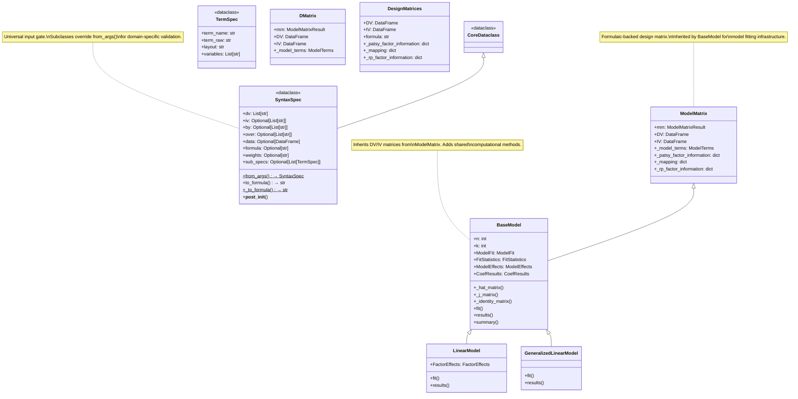
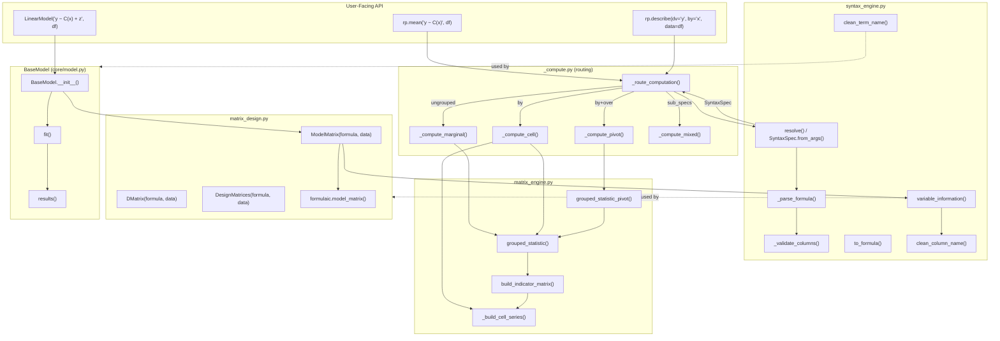
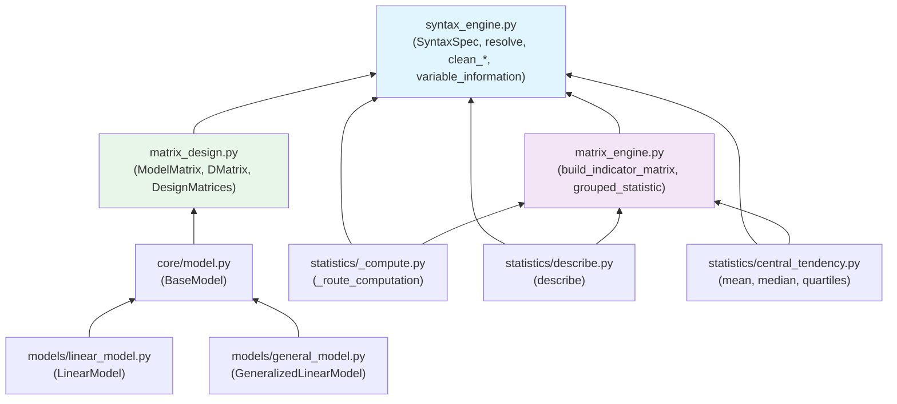

# Syntax Engine, Matrix Engine & Matrix Design — Architecture

## Class Hierarchy & Method Resolution



## Data Flow



## Engine Responsibilities

```
┌─────────────────────────────────────────────────────────────────────────────────┐
│                        THREE ENGINES — SEPARATION OF CONCERNS                    │
├─────────────────────────────────────────────────────────────────────────────────┤
│                                                                                  │
│  ┌─────────────────────────────────────────────────────────────────────────┐    │
│  │  SYNTAX ENGINE (syntax_engine.py)                                        │    │
│  │  ─────────────────────────────────────────────────────────────────────── │    │
│  │  Role: Universal input parsing & formula handling                         │    │
│  │                                                                           │    │
│  │  Classes:                                                                 │    │
│  │    • SyntaxSpec — normalized computation specification (dataclass)        │    │
│  │    • TermSpec   — single term from a mixed formula (dataclass)            │    │
│  │                                                                           │    │
│  │  Functions:                                                               │    │
│  │    • resolve()              — module-level wrapper for SyntaxSpec.from_args│    │
│  │    • clean_term_name()      — strip C() wrapper from term strings         │    │
│  │    • clean_column_name()    — strip C()/[T.x] from column name strings    │    │
│  │    • variable_information() — build term/column/level mappings            │    │
│  │    • _parse_formula()       — formula → SyntaxSpec via ModelTerms         │    │
│  │    • _validate_columns()    — check columns exist in DataFrame            │    │
│  │    • _is_star_expansion()   — detect A*B formula pattern                  │    │
│  │    • _build_sub_specs()     — mixed formula → list of TermSpec            │    │
│  │    • _resolve_groupby()     — GroupBy → SyntaxSpec                        │    │
│  │                                                                           │    │
│  │  Dependencies: numpy, pandas, researchpy.containers.CoreDataclass         │    │
│  │  Depended on by: matrix_engine (indirect), matrix_design, _compute,       │    │
│  │                   describe, central_tendency, intervals, _dispatcher       │    │
│  └─────────────────────────────────────────────────────────────────────────┘    │
│                                                                                  │
│  ┌─────────────────────────────────────────────────────────────────────────┐    │
│  │  MATRIX ENGINE (matrix_engine.py)                                        │    │
│  │  ─────────────────────────────────────────────────────────────────────── │    │
│  │  Role: Indicator matrix arithmetic for grouped descriptive statistics     │    │
│  │                                                                           │    │
│  │  Functions:                                                               │    │
│  │    • build_indicator_matrix()    — full one-hot (all levels, no contrast) │    │
│  │    • grouped_statistic()         — X.T @ values matrix computation        │    │
│  │    • grouped_statistic_pivot()   — grouped_statistic + pivot reshaping    │    │
│  │    • _build_cell_series()        — combine group columns into cell labels │    │
│  │                                                                           │    │
│  │  Supported stats: mean, sum, count, variance, sd, se                      │    │
│  │                                                                           │    │
│  │  Dependencies: numpy, pandas (NO researchpy imports)                      │    │
│  │  Depended on by: _compute.py, describe.py, central_tendency.py            │    │
│  └─────────────────────────────────────────────────────────────────────────┘    │
│                                                                                  │
│  ┌─────────────────────────────────────────────────────────────────────────┐    │
│  │  MATRIX DESIGN (matrix_design.py)                                        │    │
│  │  ─────────────────────────────────────────────────────────────────────── │    │
│  │  Role: Formulaic-backed contrast-coded design matrices for model fitting  │    │
│  │                                                                           │    │
│  │  Classes:                                                                 │    │
│  │    • ModelMatrix       — primary class (formulaic, ModelTerms, mappings)   │    │
│  │    • DMatrix           — identical to ModelMatrix (legacy duplication)     │    │
│  │    • DesignMatrices    — simpler wrapper (no ModelTerms)                   │    │
│  │    • DesignMatrix      — DV-only matrix (no IV)                           │    │
│  │                                                                           │    │
│  │  Key attributes (ModelMatrix/DMatrix):                                    │    │
│  │    • .DV               — response (left-hand side) DataFrame              │    │
│  │    • .IV               — predictor (right-hand side) DataFrame/ndarray    │    │
│  │    • ._model_terms     — ModelTerms dataclass (term→column mapping)       │    │
│  │    • ._mapping         — raw column name → cleaned level name             │    │
│  │    • ._rp_factor_information — variable → unique levels                   │    │
│  │                                                                           │    │
│  │  Dependencies: formulaic, researchpy.core.syntax_engine,                  │    │
│  │                researchpy.containers.ModelTerms                            │    │
│  │  Depended on by: BaseModel (inherits ModelMatrix)                         │    │
│  └─────────────────────────────────────────────────────────────────────────┘    │
│                                                                                  │
└─────────────────────────────────────────────────────────────────────────────────┘
```

## Method / Function Matrix

### syntax_engine.py

| Function / Method | Purpose | Called By |
|---|---|---|
| `SyntaxSpec.from_args()` | Universal input resolution (5 calling conventions) | `resolve()`, subclass overrides |
| `SyntaxSpec.to_formula()` | Instance → formula string reconstruction | `__post_init__()`, user code |
| `SyntaxSpec._to_formula()` | Static helper for keyword-based formula generation | `from_args()` (Convention 4) |
| `SyntaxSpec.__post_init__()` | Validates fields, generates formula if missing | Dataclass construction |
| `resolve()` | Module-level backward-compat wrapper | `_compute.py`, `describe.py`, `central_tendency.py`, `intervals.py`, `_dispatcher.py` |
| `clean_term_name()` | `"C(drug, Treatment(2)):disease"` → `"drug:disease"` | `variable_information()`, `anova.py`, `linear_model.py` |
| `clean_column_name()` | `"C(drug)[T.1]:disease"` → `"1:disease"` | `variable_information()` |
| `variable_information()` | Build term/column/level metadata from model spec | `matrix_design.py` (ModelMatrix, DMatrix, DesignMatrices) |
| `_parse_formula()` | Formula string → SyntaxSpec via ModelTerms | `from_args()` (Convention 2) |
| `_validate_columns()` | Assert columns exist in DataFrame | `from_args()`, `_parse_formula()` |
| `_is_star_expansion()` | Detect `A*B` pattern (main effects + interaction) | `_parse_formula()` |
| `_build_sub_specs()` | Mixed formula → list of TermSpec | `_parse_formula()` |
| `_resolve_groupby()` | Pandas GroupBy → SyntaxSpec | `from_args()` (Convention 1 variant) |

### matrix_engine.py

| Function | Purpose | Called By |
|---|---|---|
| `build_indicator_matrix()` | Full one-hot matrix (n × k), all levels, no contrasts | `grouped_statistic()` |
| `grouped_statistic()` | Matrix arithmetic: `X.T @ values / counts` | `_compute.py`, `describe.py`, `grouped_statistic_pivot()` |
| `grouped_statistic_pivot()` | `grouped_statistic()` + pivot reshape (by × over) | `_compute_pivot()` |
| `_build_cell_series()` | Combine group columns into `:` -joined cell labels | `build_indicator_matrix()`, `_compute.py`, `describe.py` |

### matrix_design.py

| Class | Purpose | Used By |
|---|---|---|
| `ModelMatrix` | Primary design matrix class (formulaic + variable_information) | `BaseModel` (inherits) |
| `DMatrix` | Legacy duplicate of ModelMatrix | `BaseModel` (alternate inheritance path) |
| `DesignMatrices` | Simpler wrapper (no ModelTerms) | Direct use in older code |
| `DesignMatrix` | DV-only matrix builder | Direct use |

## Adding a New Statistical Test or Model

### Adding a Descriptive Statistic (using syntax_engine + matrix_engine)

```python
from researchpy.statistics._compute import _route_computation

def my_stat(
    arg1=None, arg2=None, /, *,
    dv=None, iv=None, by=None, over=None, data=None,
    decimals=4,
):
    """Compute my_stat for all 5 calling conventions."""
    def _scalar_func(arr):
        # Pure function: 1-D float array (NaN-free) → scalar
        return float(arr.sum() / (len(arr) - 1))  # example

    return _route_computation(
        arg1, arg2,
        dv=dv, iv=iv, by=by, over=over, data=data,
        scalar_func=_scalar_func,
        matrix_stat=None,       # None = non-linear path (iterates groups)
        # matrix_stat="mean",   # Use this if stat is linear (matrix arithmetic)
        decimals=decimals,
        stat_label="MyStat",
    )
```

That's it. `_route_computation` handles:
- Input resolution via `syntax_engine.resolve()`
- Routing to ungrouped / marginal / cell / pivot / mixed layout
- Delegating grouped computation to `matrix_engine`

### Adding a New Model (using syntax_engine + matrix_design)

```python
from models.base import BaseModel


class PoissonModel(BaseModel):
   """Poisson regression model."""

   def __init__(self, formula_like, data=None, conf_level=0.95):
      super().__init__(
              formula_like, data,
              family="poisson", link="log",
              conf_level=conf_level,
      )
      # BaseModel.__init__ already:
      #   1. Calls ModelMatrix.__init__(formula, data) → builds DV, IV
      #      which internally calls syntax_engine.variable_information()
      #   2. Sets up ModelFit, FitStatistics, CoefResults containers
      #   3. Builds model_terms from formulaic ModelSpec

   def fit(self):
      """Fit via IRLS or MLE."""
      # self.DV, self.IV are ready (from ModelMatrix)
      # self.n, self.k are set (from BaseModel)
      ...

   def results(self, return_type="Dataframe"):
      """Return formatted results."""
      ...
```

**What you get for free from the inheritance chain:**

| From | You Get |
|------|---------|
| `ModelMatrix` | `.DV`, `.IV`, `._model_terms`, `._mapping`, `._rp_factor_information` |
| `BaseModel` | `.n`, `.k`, `.ModelFit`, `.FitStatistics`, `.CoefResults`, `._hat_matrix()`, `._j_matrix()`, `._identity_matrix()`, `.summary()` |

### Adding a Domain-Specific SyntaxSpec Subclass

```python
from researchpy.core.syntax_engine import SyntaxSpec
from dataclasses import dataclass

@dataclass
class TTestSpec(SyntaxSpec):
    """Adds t-test-specific validation."""

    @classmethod
    def from_args(cls, arg1=None, arg2=None, /, **kwargs):
        spec = super().from_args(arg1, arg2, **kwargs)
        # Domain-specific validation
        if spec.by is not None and len(spec.by) != 1:
            raise ValueError("T-test requires exactly one grouping variable.")
        return spec
```

## Dependency Direction (strict, no cycles)



**Rule:** Arrows point from consumer → dependency. No arrow may point downward (no circular deps).

## Design Principles

1. **Single Responsibility** — Each engine has exactly one job:
   - `syntax_engine`: parse & normalize input
   - `matrix_engine`: grouped descriptive computation via matrix arithmetic
   - `matrix_design`: build design matrices for model fitting

2. **Strict Dependency Direction** — `syntax_engine` depends on nothing in researchpy (except `containers`). `matrix_engine` depends on nothing. `matrix_design` depends on `syntax_engine`. This eliminates circular imports by construction.

3. **Two Matrix Pathways, One Syntax Layer** — Descriptive stats and model fitting share the same syntax/parsing layer but use fundamentally different matrix representations:
   - Descriptive: full indicator (all levels, no contrasts) → `matrix_engine`
   - Models: contrast-coded (reference dropped, intercept) → `matrix_design`

4. **Subclass Extension via `from_args()`** — Domain-specific tests (t-test, ANOVA) subclass `SyntaxSpec` and override `from_args()` to add validation while inheriting all 5 calling conventions.

5. **Linear vs Non-Linear Computation Paths** — `matrix_engine` provides an optimized matrix-arithmetic path for linear statistics (`X.T @ values / counts`) and a fallback iteration path for non-linear statistics (median, percentiles). The router (`_compute.py`) selects the path based on `matrix_stat` parameter.

6. **No Hidden Transformations** — `SyntaxSpec` is a transparent dataclass. Every field is directly inspectable. The formula ↔ keyword mapping is explicit and reversible via `to_formula()`.

7. **Backward Compatibility via Aliases & Wrappers** — `ComputeSpec = SyntaxSpec`, `patsy_term_cleaner()` → `clean_term_name()`, `patsy_column_cleaner()` → `clean_column_name()`. Old code continues to work while new code uses canonical names.